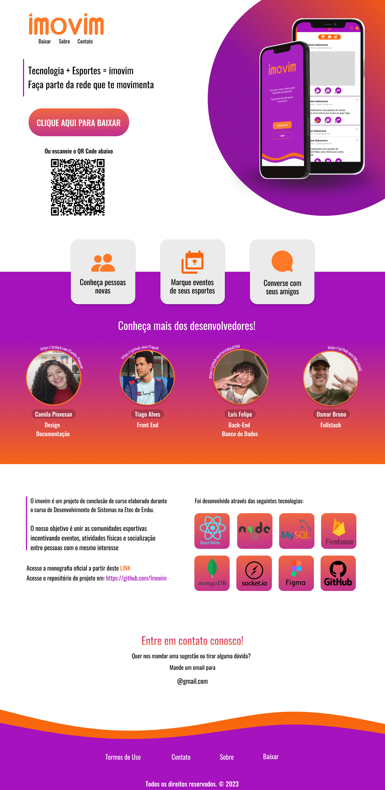

<h1 align="center"> Landing Page imovim </h1>

  Página de apresentação para o trabalho de conclusão do curso de Desenvolvimento de Sistemas.   

  <a href="#-tecnologias">Tecnologias</a>&nbsp;&nbsp;&nbsp;|&nbsp;&nbsp;&nbsp;
  <a href="#-projeto">Projeto</a>&nbsp;&nbsp;&nbsp;|&nbsp;&nbsp;&nbsp;
  <a href="#-layout">Layout</a>&nbsp;&nbsp;&nbsp;|&nbsp;&nbsp;&nbsp;
  <a href="#memo-licença">Licença</a>

  

 

  

## 🚀 Tecnologias

Esse projeto foi desenvolvido com as seguintes tecnologias:

- React
- JavaScript
- Git e Github
- Figma

## 💻 Projeto

A landing page é uma página de apresentação de um produto ou de um sistema, ela pode ou não direcionar  o usuário à uma infomação. Neste caso, o objetivo é encaminhar o usuário para o link de download da aplicação imovim, além de expor uma breve explicação sobre a plataforma, os desenvolvedores envolvidos e meios para contato.

## 🧵 Layout

Você pode visualizar o layout do projeto através [DESSE LINK](https://www.figma.com/file/XcLGwNRW1qLCBhAM4YmJUL/IMOVIM?node-id=591%3A36&t=cTYHbDcIFRCt9NyC-1) apresente na página 2. É necessário ter conta no [Figma](https://figma.com) para acessá-lo.

## 🧾 Licença

Esse projeto está sob a licença MIT.

---
